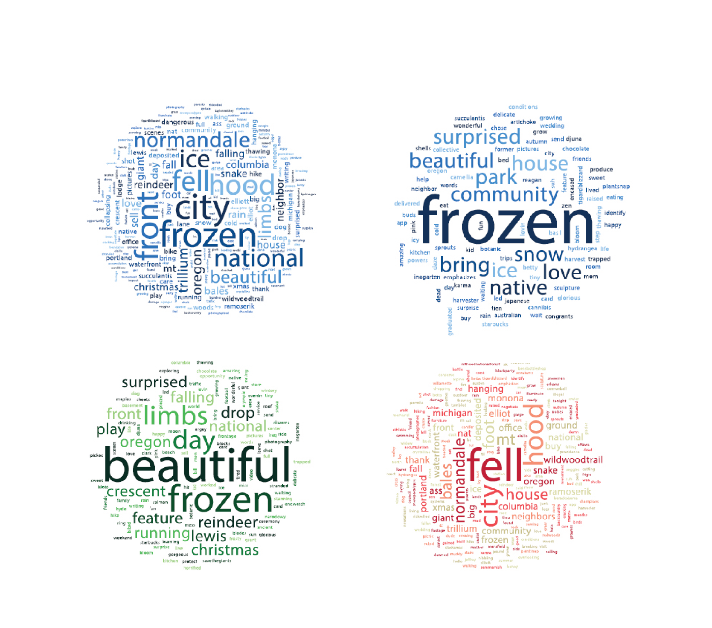

# MPH-Culminating-Experience #

Script and final report of assessing Twitter for potential use in urban nature research

**Author:** [Andrew Larkin](https://www.linkedin.com/in/andrew-larkin-525ba3b5/)  
**Affiliation:** [George Washington University, Milken Institute for Public Health](https://publichealth.gwu.edu/)  
**Primary Mentor:** [Christina Hemminger](https://publichealth.gwu.edu/departments/prevention-and-community-health/christina-heminger)  
**Date created:** September 24th, 2018

**Summary**  
This project downloaded two weeks of Twitter data from the Portland, OR metropolitan region in December 2016.  Tweets were then coded by hand and evaluated for potential use in public health urban nature research.  Tweets were downloaded using the tweepy package in python.

**Files**  
[**Larkin_Andrew_CEFinalProject.docx**](Larkin_Andrew_CEFinalProject.docx) - final report of critical analysis  
[**SearchDataGreen.py**](SearchDataGreen.py) - script used to download tweets 

**External links**  
**Tweepy** - http://www.tweepy.org/

